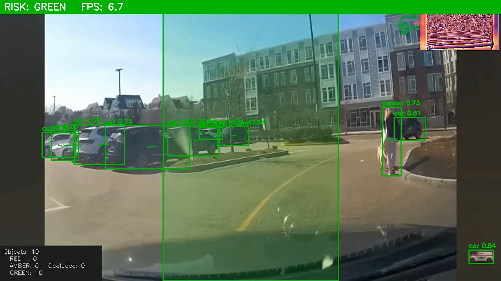
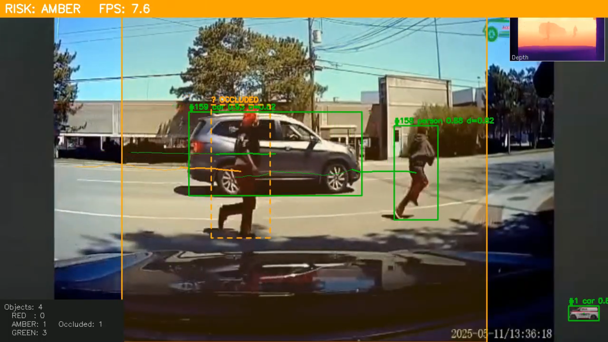
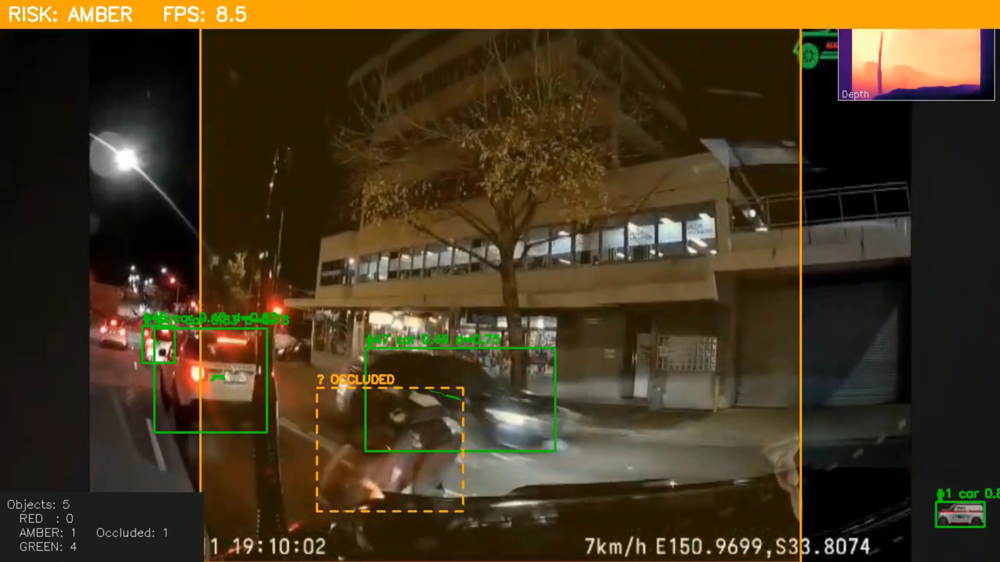
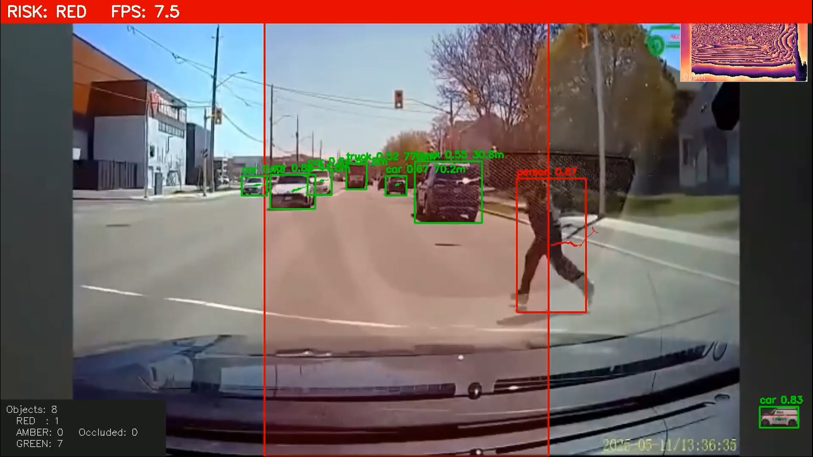

# 🚗 Real-time Pedestrian Detection & Risk Warning System for Autonomous Vehicles

<p align="center">
  
  
  
  
  
</p>

<p align="center">
  <b>AAE4011 – Artificial Intelligence in Unmanned Autonomous Systems</b><br>
  The Hong Kong Polytechnic University<br>
  Instructor: Dr. Weisong WEN
</p>

> **Group Members:** AL AKIB Ahmad Munjir (23096168D) &nbsp;|&nbsp; CHAU Cheuk Hei (23089671D) &nbsp;|&nbsp; **Date:** April 14, 2026

<p align="center">
  <a href="https://youtu.be/mdRpK6RcI6A">
    
  </a>
  &nbsp;
  <a href="https://github.com/CHAUCHEUKHEI/AAE4011_Pedestrian_Detection_and_Risk_Warning_System">
    
  </a>
</p>

---

## 📋 Table of Contents

- [Overview](#-overview)
- [Methodology](#-methodology)
- [Repository Structure](#-repository-structure)
- [Prerequisites](#-prerequisites)
- [How to Run](#-how-to-run)
- [Sample Results](#-sample-results)
- [Video Demonstration](#-video-demonstration)
- [Reflection & Critical Analysis](#-reflection--critical-analysis)
- [References](#-references)

---

## 🔍 Overview

This project implements a real-time, end-to-end **Pedestrian Detection and Risk Warning System** designed for autonomous vehicles and drone-based surveillance. The system addresses a fundamental limitation in standard object detection pipelines: knowing not merely *what* objects are present in a scene, but *how immediately dangerous each one is*.

The pipeline integrates five AI-driven stages:

- 🎯 **YOLOv8m detection** of 8 target classes including pedestrians, cyclists, and large vehicles
- 🔁 **ByteTrack multi-object tracking** with persistent IDs and motion trails
- 📏 **Depth Anything V2** monocular metric depth estimation in real metres
- 🫥 **Overlap-fraction occlusion detection** for pedestrians hidden behind parked vehicles
- 🚦 **Risk classification engine** producing GREEN / AMBER / RED scene-level warnings with audio alerts

The system is designed to be modular, configuration-driven, and hardware-agnostic — running on both GPU-accelerated and CPU-only platforms without code changes.

---

## 🎯 Methodology

### Model: YOLOv8m — Pretrained on COCO

The detection backbone is **YOLOv8-medium (YOLOv8m)**, loaded from Ultralytics pretrained weights on the COCO dataset. The medium variant was specifically chosen over the nano, small, large, and extra-large variants based on a deliberate accuracy-speed trade-off.

**⚡ Why YOLOv8m over nano (YOLOv8n)?**
YOLOv8n achieves ~37.3% mAP₅₀ on COCO, while YOLOv8m achieves ~50.2%. For a pedestrian risk warning system where missed detections carry a higher cost than reduced throughput, the medium variant's superior recall on small and partially visible objects justifies the added inference cost. In a safety-critical pipeline, a missed pedestrian at 3 metres is an unacceptable failure mode.

**⚡ Why not YOLOv8l or YOLOv8x?**
Larger variants offer marginal accuracy gains at substantially higher latency. At the operating speeds of campus rovers and low-altitude UAVs (10–30 km/h), the medium model's ~8 fps end-to-end throughput provides sufficient temporal resolution for real-time risk assessment.

**🔄 Why not Faster R-CNN or SSD?**

| Model | Speed | Accuracy | Verdict |
|---|---|---|---|
| **YOLOv8m** ✅ | Fast (single-pass, anchor-free) | mAP₅₀ ~50.2% | Best balance for real-time safety pipeline |
| Faster R-CNN | 5–10× slower (two-stage: RPN + classifier) | Higher mAP on benchmarks | Unacceptable latency for continuous video stream |
| SSD | Faster than Faster R-CNN | Lower precision on small/occluded objects | Insufficient recall for distant pedestrians |

**✅ Why no fine-tuning required?**
The COCO dataset already contains all eight target classes: `person` (0), `bicycle` (1), `car` (2), `motorcycle` (3), `bus` (5), `truck` (7), `cat` (15), and `dog` (16). Pretrained weights generalise directly to urban driving footage without additional training or data preparation.

---

### 🔁 Tracking: ByteTrack

Multi-object tracking uses **ByteTrack**, which associates *every* detection box — including low-confidence ones — with existing tracklets in a two-stage matching process via Kalman filter and IoU association. Unlike high-confidence-only trackers, ByteTrack significantly reduces identity switches and tracklet fragmentation in occluded or crowded scenes. Each track carries a persistent integer ID and a 30-frame motion trail history (~1 second at 30 fps), used both for visualisation and velocity estimation.

---

### 📏 Depth Estimation: Depth Anything V2 Metric

Depth estimation is performed by **Depth Anything V2 Metric Outdoor Base**, which outputs depth in **absolute metres** — a critical distinction from relative depth models whose normalised outputs cannot be mapped to physically meaningful safety thresholds.

A relative depth model might indicate that object A is "closer than" object B, but cannot answer: *Is object A within 4 metres?* For a risk warning system with hard distance thresholds (RED < 4 m, AMBER < 10 m), metric depth is a non-negotiable requirement. Per-object depth is sampled from the 20th percentile of the lower-centre bounding-box patch to avoid ground-plane bias and handle partial occlusion robustly.

---

### 🫥 Occlusion Detection: Overlap Fraction (not IoU)
Occlusion is detected by computing the fraction of a vulnerable object's bounding box that is covered by a large vehicle's bounding box. Standard **IoU is deliberately avoided** here. IoU normalises against the *union* of both boxes, causing large vehicle boxes to dominate the denominator and keeping IoU artificially low even when a pedestrian is substantially hidden. The overlap fraction normalises against only the vulnerable object's area, directly quantifying *what fraction of the pedestrian is concealed*. If overlap ≥ 0.20, the pedestrian is flagged as occluded and forced to AMBER risk regardless of measured depth.

---

### 🚦 Risk Engine: Thresholds + Trajectory + Asymmetric Smoothing

**In-lane objects (metric depth scoring):**

| Depth | Risk Level |
|---|---|
| < 4.0 m | 🔴 RED |
| 4.0 – 10.0 m | 🟠 AMBER |
| ≥ 10.0 m | 🟢 GREEN |

**Out-of-lane objects (trajectory prediction):**
Velocity is smoothed over the last 5 frames and projected forward up to 25 frames. If the projected path enters the lane corridor within 10 frames → RED; within 20 frames → AMBER.

**Asymmetric temporal smoothing — key safety design:**
- ⬆️ **Upgrades** (GREEN→AMBER, AMBER→RED): applied **immediately** — safety-critical transitions must not be delayed
- ⬇️ **Downgrades** (RED→AMBER, AMBER→GREEN): require **2/3 frame consensus** — prevents flicker at depth boundaries without delaying genuine warnings

---

## 📁 Repository Structure

- **AAE4011_Pedestrian_Detection_Risk_Warning/**
  - `config_4011.py` - Central configuration (thresholds, feature flags)
  - `detector_4011.py` - YOLOv8m detection wrapper (abstracts Ultralytics API)
  - `tracker_4011.py` - ByteTrack + 30-frame motion trail manager
  - `depth_estimator_4011.py` - Depth Anything V2 Metric Outdoor wrapper
  - `occlusion_4011.py` - Overlap-fraction occlusion detection
  - `risk_engine_4011.py` - Risk scoring, trajectory prediction, temporal smoothing
  - `warning_4011.py` - Stateful audio alerts (beepy / pyttsx3)
  - `display_4011.py` - OpenCV visualisation and overlay rendering
  - `main_4011.py` - Main orchestration script (pipeline entry point)
  - `requirements.txt` - Python dependencies
  - `README.md` - This file

**Key files described:**

- `main_4011.py` — Orchestrates the frame loop, calling each module in sequence per frame and writing the annotated output video
- `config_4011.py` — Single source of truth for all thresholds, feature flags (`ENABLE_TRACKING`, `ENABLE_RISK`, etc.), and display parameters
- `risk_engine_4011.py` — Most complex module: evaluates lane position, metric depth, trajectory, and occlusion flags to produce stable per-track and scene-level risk
- `warning_4011.py` — Stateful manager that fires audio alerts only on upward risk transitions; runs in non-blocking daemon threads

---

## 🛠️ Prerequisites

| Item | Version |
|---|---|
| Operating System | Ubuntu 20.04 / Windows (WSL2) / macOS |
| Python | 3.8+ |
| PyTorch / torchvision | 2.0+ |
| `ultralytics` | ≥ 8.0 |
| OpenCV (`opencv-python`) | ≥ 4.8 |
| `transformers` (HuggingFace) | ≥ 4.40 |
| NumPy | ≥ 1.24 |
| `beepy` | latest *(optional — audio alerts)* |
| `pyttsx3` | latest *(optional — TTS alerts)* |

Install all dependencies:

```bash
pip install -r requirements.txt
```

> **GPU acceleration:** PyTorch automatically detects and uses CUDA when available. The system runs on CPU-only machines without code modification, though at reduced throughput.

---

## 🚀 How to Run

### Step 1 — Clone the Repository

```bash
git clone https://github.com/CHAUCHEUKHEI/AAE4011_Pedestrian_Detection_and_Risk_Warning_System.git
cd AAE4011_Pedestrian_Detection_and_Risk_Warning_System
```

### Step 2 — Install Dependencies

```bash
pip install -r requirements.txt
```

### Step 3 — Configure Video Source

Open `config_4011.py` and set your input:

```python
# config_4011.py

VIDEO_SOURCE = "path/to/your/video.mp4"   # video file
# VIDEO_SOURCE = 0                         # live webcam (index 0)
```

You can also toggle individual pipeline stages:

```python
ENABLE_TRACKING   = True    # ByteTrack multi-object tracking
ENABLE_RISK       = True    # Risk engine + depth estimation
ENABLE_OCCLUSION  = True    # Overlap-fraction occlusion detection
ENABLE_WARNINGS   = False   # Audio alerts (set True to enable)
```

### Step 4 — Run the Pipeline

```bash
python main_4011.py
```

The annotated output is saved as `output4011.mp4` in the working directory.

### Step 5 — Quit / View Output

- **Desktop:** Press `Q` to quit the live preview window
- **Google Colab:** The output video auto-plays in the notebook after processing completes

### Step 6 — (Optional) Running in Google Colab

```python
# Mount Google Drive if your video is stored there
from google.colab import drive
drive.mount('/content/drive')

# Run the pipeline
!python main_4011.py
```

---

## 📊 Sample Results

### Detection Class Reference

| Class | COCO ID | Risk Role | Notes |
|---|---|---|---|
| Person | 0 | Vulnerable (scored by depth + trajectory) | Primary detection target |
| Bicycle | 1 | Vulnerable | Treated same as person |
| Car | 2 | Occlusion source + in-lane scoring | RED if < 4 m in lane |
| Motorcycle | 3 | Vulnerable | |
| Bus | 5 | Occlusion source + in-lane scoring | |
| Truck | 7 | Occlusion source + in-lane scoring | |
| Cat | 15 | Vulnerable | |
| Dog | 16 | Vulnerable | |

### Risk Classification Summary

| Condition | Risk Level | Visual |
|---|---|---|
| In-lane object, depth < 4.0 m | RED | Red bounding box + red banner |
| In-lane object, depth < 10.0 m | AMBER | Orange bounding box + orange banner |
| Out-of-lane object, enters lane < 10 frames | RED | Red bounding box |
| Out-of-lane object, enters lane < 20 frames | AMBER | Orange bounding box |
| Occluded vulnerable object (any depth) | AMBER (forced) | Dashed orange box + `? OCCLUDED` |
| All other detections | GREEN | Green bounding box |

### System Performance

| Metric | Value |
|---|---|
| End-to-end FPS (GPU, Colab) | ~7.5 – 8.6 fps |
| Output resolution | 1280 × 720 px |
| Detection model | YOLOv8m (float32) |
| Depth model precision | float16 (GPU) |
| Output format | MP4 (H.264, 20 fps) |

### Sample Screenshots

| GREEN — Clear road, distant vehicles | AMBER — Pedestrian in lane |
|---|---|
|  |  |
| *All detections ≥ 10 m, no inward trajectory* | *Pedestrian detected in corridor at 5–8 m* |

| AMBER (Occlusion) — Hidden pedestrian | RED — Close-range object in lane |
|---|---|
|  |  |
| *Dashed box + `? OCCLUDED`, forced AMBER* | *Object < 4 m in lane, double-beep warning* |

---

## 🎬 Video Demonstration

[](https://youtu.be/mdRpK6RcI6A)

📺 **Link:** https://youtu.be/mdRpK6RcI6A  
⏱️ **Duration:** 04:03 min

The video demonstrates all key system components:

- **(a) System launching and model loading** — Terminal output confirms YOLOv8m weights loaded and Depth Anything V2 initialised; first annotated frame appears within a few seconds
- **(b) Live detection with risk-coloured bounding boxes** — GREEN, AMBER, and RED boxes shown on real dashcam footage with class labels, confidence scores, and track IDs
- **(c) Occlusion detection** — Pedestrian behind parked car shown with dashed bounding box and `? OCCLUDED` label; forced AMBER regardless of depth reading
- **(d) Depth map thumbnail** — MAGMA-coloured depth map in top-right corner; warm colours indicate closer objects, confirming depth model output
- **(e) Risk transitions with audio alerts** — Full GREEN → AMBER → RED transition sequence shown; audio warnings triggered only on upward transitions to avoid alarm fatigue

---

## 💬 Reflection & Critical Analysis

### (a) What Did We Learn?

**Skill 1 — Building a modular AI inference pipeline:**
Prior to this project, We had experience with standalone detection scripts but not with integrating multiple sequential AI models into a single real-time pipeline. Building the system module-by-module — with each stage independently toggleable via feature flags in `config_4011.py` — taught us how to manage inter-module data contracts and how to isolate and debug individual stages without disrupting the full pipeline. A key lesson was model loading strategy: all models must be loaded in the class `__init__` method and reused across frames, never reloaded per-frame. Reloading weights even once per second adds hundreds of milliseconds of latency and renders the system unusable.

**Skill 2 — Monocular metric depth estimation in real-world metres:**
Working with Depth Anything V2 taught us the practical distinction between relative and metric depth — a distinction that is not always emphasised in introductory computer vision courses. We learned how to sample depth robustly from a bounding box using the 20th-percentile lower-centre patch technique, which substantially outperforms naive centroid or mean sampling by avoiding background pixels and ground-plane artefacts within the bounding box boundary.

**Skill 3 — Asymmetric temporal smoothing for flicker prevention:**
The most counterintuitive insight from this project was that naive temporal averaging — treating upgrades and downgrades symmetrically — makes a safety system *less* safe. An object measured at exactly 4.0 m that fluctuates between RED and AMBER on consecutive frames due to depth noise produces rapidly alternating warnings that operators learn to ignore. Asymmetric smoothing — immediate upgrades, consensus-gated downgrades — encodes a correct safety philosophy and was the most satisfying engineering design decision of the project.

**Skill 4 — Occlusion reasoning with overlap fraction vs. IoU:**
Understanding why IoU fails as an occlusion metric for large vehicle / small pedestrian pairs was a valuable lesson in choosing the right metric for the right geometry. When a bus (large box) overlaps a pedestrian (small box), the union denominator is dominated by the bus, making IoU small even when the pedestrian is 60% hidden. The overlap fraction directly measures the quantity of safety interest.

---

### (b) How Did We Use AI Tools?

**Primary tools:** Claude (code generation and debugging) and Perplexity AI (research and technical concepts).

| Use Case | How AI Helped |
|---|---|
| Architecture design | Suggested the modular pipeline structure with independent feature flags per stage |
| Code scaffolding | Generated initial boilerplate for each module (detection wrapper, Flask UI, ByteTrack integration) |
| Debugging | Diagnosed tensor shape mismatches between Depth Anything V2 output and OpenCV resize; identified float16 precision issues on CPU inference |
| Research | Rapidly surfaced relevant papers on ByteTrack, VisDrone benchmarks, and occlusion-aware detection; summarised key contributions efficiently |
| Concept clarification | Explained the difference between relative and metric depth models, and why the 20th-percentile sampling approach is robust to partial occlusion |
| Writing | Provided style suggestions for the report and README; assisted with language clarity and academic tone |

**Benefits:** AI substantially accelerated the boilerplate and debugging stages, allowing more project time to be spent on architectural design and the risk engine logic — the most technically interesting parts of the system. It also provided clear rationale for design choices (e.g., why `queue_size=1` in ROS callbacks), deepening understanding rather than just delivering code.

**Limitations:** AI occasionally suggested outdated API syntax — for example, proposing deprecated `ultralytics` argument names from earlier YOLO versions, and suggesting relative depth models like MiDaS when metric depth was explicitly required. These errors were immediately identified by cross-referencing the official Ultralytics and HuggingFace Transformers documentation before implementation. The AI also could not verify claims against the actual video footage or measure real inference FPS — those required hands-on testing. In all cases, AI served as an accelerator for well-understood tasks; domain verification and design decisions remained the responsibility of the student.

---

### (c) How to Improve Accuracy?

**Strategy 1 — Fine-tune on aerial and drone-perspective imagery:**
YOLOv8m was pretrained exclusively on ground-level COCO images where vehicles and pedestrians appear at familiar aspect ratios and side-on viewpoints. Elevated or drone-mounted cameras capture pedestrians from a near-top-down perspective, creating a viewpoint mismatch that reduces detection confidence and recall. Fine-tuning on aerial-specific datasets such as **VisDrone** or **UAVDT** — which contain thousands of labelled examples from UAV perspectives — would directly condition the model to overhead viewpoints. Even 500–1,000 labelled aerial images appended to the training set can boost mAP@0.5 on aerial benchmarks by 5–15 percentage points.

**Strategy 2 — Stereo or structured-light depth instead of monocular:**
Monocular depth estimation degrades beyond approximately 30 metres and is fundamentally underdetermined — the network relies on learned scene statistics rather than geometric triangulation. A stereo camera pair or a structured-light depth sensor (e.g., Intel RealSense D435) would provide accurate per-pixel depth via disparity maps with no learning required, eliminating depth noise as a source of false AMBER/RED classifications at range boundaries. For UAV deployment where weight is constrained, a lightweight stereo pair is feasible; for ground vehicles, LiDAR provides the gold standard but at significantly higher cost and power.

**Strategy 3 — Ensemble methods for occlusion detection:**
The current overlap-fraction approach is a purely geometric heuristic. It flags occlusion only when a large vehicle's bounding box physically overlaps a pedestrian's bounding box, which requires both to be detected simultaneously. A pedestrian fully hidden behind a van (no visible bounding box at all) is completely undetected. An ensemble approach combining geometric overlap with a learned occlusion classifier — trained to infer the *probable position* of hidden pedestrians based on contextual cues such as vehicle type, gap geometry, and scene layout — would substantially improve recall for fully occluded VRUs.

---

### (d) Real-World Challenges

**Challenge 1 — Computational constraints on embedded drone hardware:**
Operational UAVs and autonomous ground vehicles use lightweight embedded computers (NVIDIA Jetson Nano, Orin NX, Raspberry Pi CM4) rather than full desktop workstations. Running YOLOv8m plus Depth Anything V2 simultaneously at 1280×720 on a Jetson Nano yields approximately 3–6 fps — insufficient for real-time risk assessment at urban speeds. Addressing this requires a combination of model compression techniques: post-training INT8 quantisation with NVIDIA TensorRT improves throughput by 3–4× with minimal accuracy loss on Jetson hardware. Alternatively, the depth model can be run at reduced frequency (every 3rd or 5th frame) with the last valid depth map reused for intermediate frames, substantially reducing the per-frame compute burden.

**Challenge 2 — Image degradation during active flight:**
The test footage was recorded under near-static, controlled dashcam conditions. Real drone flights introduce several image degradation factors: (i) **motion blur** from translational or rotational manoeuvres blurs pedestrian outlines and reduces bounding box confidence; (ii) **propeller vibration jitter** can saturate or underexpose frames, causing confidence scores to fall below detection thresholds; (iii) **rolling shutter distortion** from CMOS sensors warps fast-moving objects in the scene. Mitigation requires 3-axis gimbal stabilisation, software frame-quality gating to skip degraded frames before inference, and training data augmentation (motion blur kernels, brightness/contrast jitter, noise injection) to condition the model against in-flight conditions.

**Challenge 3 — Real-time constraints vs. model accuracy trade-offs:**
The system currently runs at ~7.5–8.6 fps end-to-end on GPU. For autonomous vehicle deployment at motorway speeds (> 80 km/h), a vehicle covers approximately 2.2 metres per frame at this throughput — meaning an object could transition from AMBER (< 10 m) to RED (< 4 m) within 2–3 frames, leaving minimal reaction time. Improving temporal resolution requires either faster models (YOLOv8n at the cost of accuracy), hardware upgrades (Jetson AGX Orin or RTX-class GPU), or architectural changes such as running detection and depth on separate parallel threads to decouple their latencies — a design the modular architecture of this system can support with relatively minor refactoring.

---

## 📚 References

1. Jocher, G., Chaurasia, A., & Qiu, J. (2023). *Ultralytics YOLOv8*. GitHub. https://github.com/ultralytics/ultralytics

2. Yang, L., Kang, B., Huang, Z., Zhao, Z., Xu, X., Feng, J., & Zhao, H. (2024). *Depth Anything V2*. Advances in Neural Information Processing Systems (NeurIPS 2024). arXiv:2406.09414. https://arxiv.org/abs/2406.09414

3. Zhang, Y., Sun, P., Jiang, Y., Yu, D., Weng, F., Yuan, Z., Luo, P., Liu, W., & Wang, X. (2022). *ByteTrack: Multi-Object Tracking by Associating Every Detection Box*. European Conference on Computer Vision (ECCV 2022). arXiv:2110.06864. https://arxiv.org/abs/2110.06864

4. Lin, T.-Y., Maire, M., Belongie, S., Hays, J., Perona, P., Ramanan, D., Dollár, P., & Zitnick, C. L. (2014). *Microsoft COCO: Common Objects in Context*. ECCV 2014. arXiv:1405.0312. https://arxiv.org/abs/1405.0312

5. Zhu, P., Wen, L., Du, D., Bian, X., Fan, H., Hu, Q., & Ling, H. (2021). *Detection and Tracking Meet Drones Challenge*. IEEE Transactions on Pattern Analysis and Machine Intelligence. https://doi.org/10.1109/TPAMI.2021.3119563

6. Du, D., Qi, Y., Yu, H., Yang, Y., Duan, K., Li, G., Zhang, W., Huang, Q., & Tian, Q. (2018). *The Unmanned Aerial Vehicle Benchmark: Object Detection and Tracking*. ECCV 2018. https://doi.org/10.1007/978-3-030-01249-6_23

7. Li, F., Li, X., Liu, Q., & Li, Z. (2022). *Occlusion Handling and Multi-Scale Pedestrian Detection Based on Deep Learning: A Review*. IEEE Access, 10, 19937–19957. https://doi.org/10.1109/ACCESS.2022.3150988

---

<p align="center">
  <a href="#-real-time-pedestrian-detection--risk-warning-system-for-autonomous-vehicles">⬆ Back to Top</a>
</p>

<p align="center">
  Submitted for AAE4011 Group Project &nbsp;|&nbsp; PolyU AAE &nbsp;|&nbsp; April 2026
</p>
